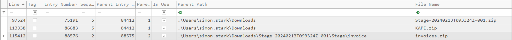
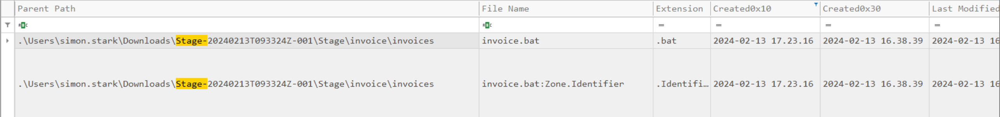
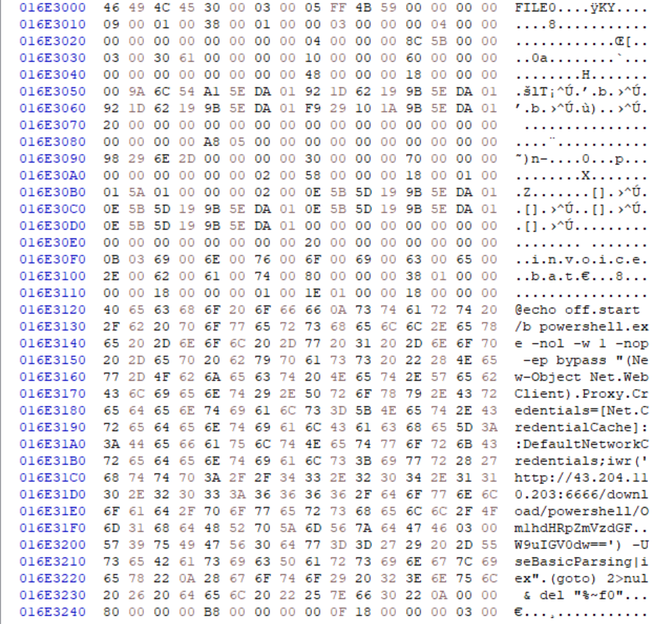

## Info

- Status: Retired

- Difficulty: Very Easy

- Track: Intro to Blue Team (Easy)

## Sherlock Scenario

In this Sherlock, you will become acquainted with MFT (Master File Table) forensics. You will be introduced to well-known tools and methodologies for analyzing MFT 
artifacts to identify malicious activity. During our analysis, you will utilize the MFTECmd tool to parse the provided MFT file, TimeLine Explorer to open and analyze the results from the parsed MFT, and a Hex editor to recover file contents from the MFT.

## Files given

We are given .zip file which has the following files and file structure:

```bash
`-- C
    `-- $MFT
```

.zip file's SHA1 hash is 433e78e7505d4158460ab627f4acf51d9f93cb3b

and $MFT file's SHA1 hash is 4db07e9e52e3147e804f6318457a27e79a7c8b69

## Beginning

To start analyzing $MFT file we need to create .csv file from it using [MFTECmd.exe](https://github.com/EricZimmerman/MFTECmd)

with the following command:

```powershell
mftecmd -f '.\$MFT' --csv ../parsed --csvf mft.csv
```

This time around the created csv file didn't have the correct timestamp format to load it to [Timeline Explorer](https://ericzimmerman.github.io/) that makes the $MFT is easier to go through.

I then had to use Python script to get the correct timestamp format and I could then load it to the Timeline Explorer to start analyzing the $MFT. (I had to convert dots between time to colons)

### Task 1

Simon Stark was targeted by attackers on February 13. He downloaded a ZIP file from a link received in an email. What was the name of the ZIP file he downloaded from the link?


Using the Timeline Explorer it is easy to look through the $MFT file. We can filter everything related to the date when Simon Stark was targeted by attackers. 

And since the file was zip file we can filter out by extension and we get the following results:



From these results we can draw conclusion that he file that he downloaded was Stage-20240213T093324Z-001.zip but we can't still know for sure that where it was downloaded from.

To make sure that it is downloaded from internet we can search using the search function for "Stage-"

From the results we can look at the "Zone.identifier" result and it seems that it was downloaded from storage.googleapis.com and we can assume that the "Stage-20240213T093324Z-001.zip" is the downloaded zip file.

**Answer:** Stage-20240213T093324Z-001.zip

 

### Task 2

Examine the Zone Identifier contents for the initially downloaded ZIP file. This field reveals the HostUrl from where the file was downloaded, serving as a valuable Indicator of Compromise (IOC) in our investigation/analysis. What is the full Host URL from where this ZIP file was downloaded?


We almost went through where the zip file was downloaded from by looking at the Zone.identifier file and at Zone Id Contents cell. It had the following information 

```
[ZoneTransfer]
ZoneId=3
HostUrl=https://storage.googleapis.com/drive-bulk-export-anonymous/20240213T093324.039Z/4133399871716478688/a40aecd0-1cf3-4f88-b55a-e188d5c1c04f/1/c277a8b4-afa9-4d34-b8ca-e1eb5e5f983c?authuser
```

From this result we can get full Host URL.

**Answer:** `https://storage.googleapis.com/drive-bulk-export-anonymous/20240213T093324.039Z/4133399871716478688/a40aecd0-1cf3-4f88-b55a-e188d5c1c04f/1/c277a8b4-afa9-4d34-b8ca-e1eb5e5f983c?authuser`


### Task 3

What is the full path and name of the malicious file that executed malicious code and connected to a C2 server?


From the same search results we can obtain information that there was malicious file when the user extracted the zip file named `invoice.bat` and we can easily draw conclusion that file executed malicious code and connected to a C2 server.

And the full path for it is C:\Users\simon.stark\Downloads\Stage-20240213T093324Z-001\Stage\invoice\invoices\invoice.bat

**Answer:** C:\Users\simon.stark\Downloads\Stage-20240213T093324Z-001\Stage\invoice\invoices\invoice.bat


### Task 4

Analyze the $Created0x30 timestamp for the previously identified file. When was this file created on disk?


To look at the timestamp for the invoice.bat we need to look at Created0x30 column.



The timestamp when the invoice.bat was created is `2024-02-13 16:38:39`

**Answer:** `2024-02-13 16:38:39`


### Task 5

Finding the hex offset of an MFT record is beneficial in many investigative scenarios. Find the hex offset of the stager file from Question 3.


To find the hex offset of the stager file we need to find the entry number for the bat file and multiply it by 1024 because this is the size of each record and the entry number for the file is 23436. We get 23 998 464 to be the decimal value we now need to convert it to hex get the hex offset.

To convert it to hexadecimal we can use the calculator in Windows and the hexadecimal value is then 16E3000.

**Answer:** 16E3000


### Task 6

Each MFT record is 1024 bytes in size. If a file on disk has smaller size than 1024 bytes, they can be stored directly on MFT File itself. These are called MFT Resident files. During Windows File system Investigation, its crucial to look for any malicious/suspicious files that may be resident in MFT. This way we can find contents of malicious files/scripts. Find the contents of The malicious stager identified in Question3 and answer with the C2 IP and port.

    

Since we now have the hex offset we need to use the HxD editor and open $MFT with it. To go to the offset and from there we can find contents of malicious files/scripts.

We can use CTRL+G to go to certain hex offset.



After the invoice.bat we can see residence of malicious powershell code and from there we can obtain the C2 IP and port which is 43.204.110.203:6666

**Answer:** 43.204.110.203:6666


## Further Analysis


### Indicators of Compromise (IOCs)

- **Malicious file:** `invoice.bat`

- **Downloaded ZIP:** `Stage-20240213T093324Z-001.zip`

- **C2 IP/Port:** `43.204.110.203:6666`


### Observations

- The actor was kinda smart to provide the malicious file using Google Cloud/storage since that most likely won't be detected by email filters


## Conclusion

This challenge helped to demonstrate how much we can retrieve from just one $MFT file. Also use of MFTECmd and Timeline Explorer tools showed how to get a lot of information from the MFT file. 


Overall this Sherlock challenge being rated as "Easy" definitely showed up. The challenge was short but I still hoped this one could have been a tad bit longer to show some of the features of Timeline Explorer. But I felt that it was brilliant to show that not everything can be found from the csv file MFTECmd created. That sometimes we need to use hex editors to our advantage to see what code/scripts the malicious actors have ran.
