## Info

- Status: Retired
- Difficulty: Medium
- Type: Malware Analysis

## Sherlock Scenario

Forela is in need of your assistance. They were informed by an employee that their Discord account had been used to send a message with a link to a file they suspect is malware. The message read: "Hi! I've been working on a new game I think you may be interested in it. It combines a number of games we like to play together, check it out!". The Forela user has tried to secure their Discord account, but somehow the messages keep being sent. They need your help to understand this malware and regain control of their account! **Warning:** This is a warning that this Sherlock includes software that is going to interact with your computer and files. This software has been intentionally      included for educational purposes and is NOT intended to be executed or used otherwise. Always handle such files in isolated, controlled, and secure environments. Once the Sherlock zip has been unzipped, you will find a DANGER.txt file. Please read this to proceed.

## Files given

We are given a `.zip` file which contains the following structure:

```bash
.
├── DANGER.txt
└── nsis-installer.exe
```

.zip file's SHA1 hash: `ae3c3639fb1e98c286c642345b66fffe947e9933`  
and the nsis-installer.exe SHA1 hash: `9fd84c0780b6555cdeed499b30e5d67071998fbc`

## Beginning

There isn't really any preprocessing steps needed in this Sherlock so let's get into it.

---

## Tasks

### Task 1

What is the Imphash of this malware installer?

We can easily find the Imphash by uploading this exe to VirusTotal since this being a malware it has most likely been uploaded before to VirusTotal. And it was.

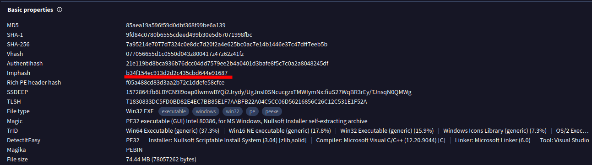

From details tab we can see the Imphash being: b34f154ec913d2d2c435cbd644e91687

**Answer:** `b34f154ec913d2d2c435cbd644e91687`

---

### Task 2

The malware contains a digital signature. What is the program name specified in the SpcSpOpusInfo Data Structure?

This we can also find from the VirusTotal Details tab under the Signature Info.

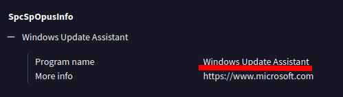

And it seems that the malware is trying to impersonate being a trusted Microsoft component named "Windows Update Assistant" which in reality should help users upgrade their PCs.

**Answer:** `Windows Update Assistant`

---

### Task 3

The malware uses a unique GUID during installation, what is this GUID?

Malware may create entries to registry under SOFTWARE hive and specifically under `HKEY_LOCAL_MACHINE\Software\Microsoft\Windows\CurrentVersion\Uninstall\{GUID}`  to make it look like it is an legitimate installed program. But we know it isn't ;)

So with this knowledge in mind we can look at the VirusTotal registry keys that the malware has set to find the GUID.

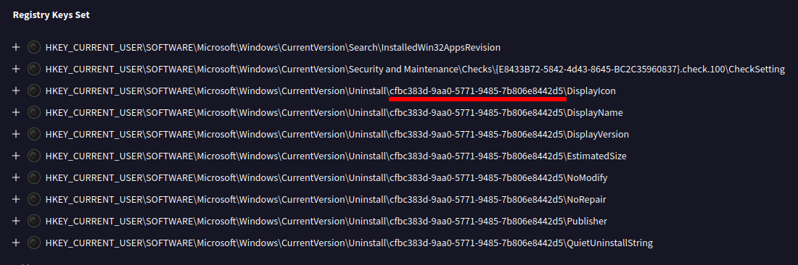

So here we can see that the malware definitely tries to show up as a legitimate installed program and also see the unique GUID which it uses during install.

**Answer:** `cfbc383d-9aa0-5771-9485-7b806e8442d5`

---

### Task 4

The malware contains a package.json file with metadata associated with it. What is the 'License' tied to this malware?

With this task I noticed that there was one step I should have made before starting the sherlock alltogether. Which was to check with DIE (Detect It Easy) for the installer.

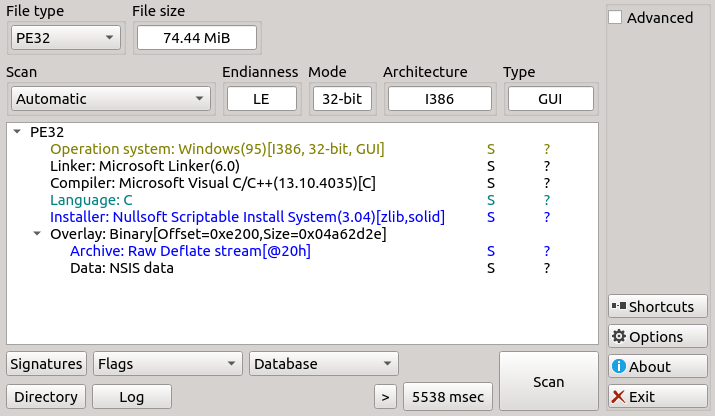

This DIE information revealed that the installer is NSIS based.

And thus it has compressed installation files which we can then extract with 7z.

Using 7z we can first take a look what files the exe contains:
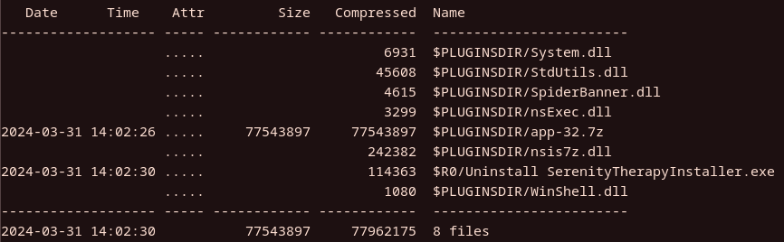

This doesn't tell us a whole lot but we can see that there is app-32.7z which looks interesting and worth looking at.

We can extract the exe by using `7z e nsis-installer.exe` which then extract every file inside the exe to the current directory.

And then further on we need to extract the app-32.7z from the `$PLUGINSDIR` .

That gives us useful content to look at an specifically since package.json was mentioned we can assume that the asar has the package.json

We can extract it by using `npx asar extract app.asar extracted` to extract it on Linux. Now inside the extracted folder we find the following files and a directory:

```bash
.
├── app.js
├── node_modules
└── package.json
```

Now we see that it has package.json and upon looking what license it has it seems to be ISC.

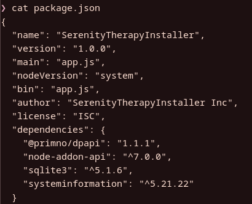

**Answer:** `ISC`

---

### Task 5

The malware connects back to a C2 address during execution. What is the domain used for C2?

Since we have now extracted the app.asar let's take a look at the js file to see which kind of code it has.

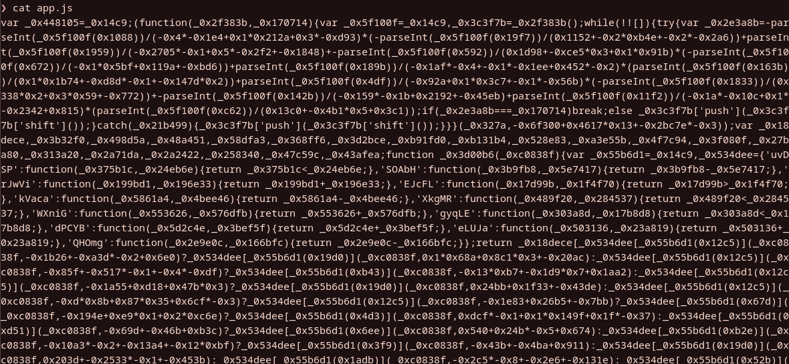

And it is all obfuscated and in this case deobfuscation doesn't work so we need to debug it in order to see the code it runs.

Since we are handling with malware we need a VM to analyze because running malware on own PC isn't the best idea. So for this case I have spun up FlareVM to run it.

I'm going to use Visual Studio Code to debug the code and using it we can see through all the obfuscated Javascript code. 

First we need to make launch.json so it will launch the app.js. Then we need to install the dpapi and sqlite3 modules and delete them from the node_modules folder to make this work.

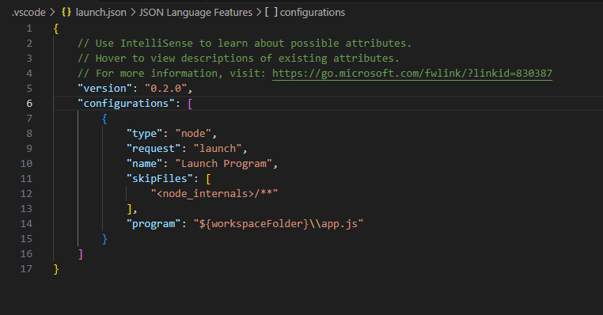

The launch.json should look something like above.

Once those steps are done we are ready to launch the program from the run and debug tab.

I ran the program for few seconds and then paused it and now the debugger shows us more readable js code.

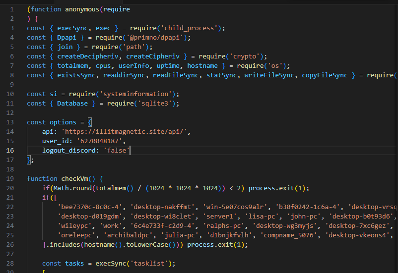

Well from here it is easy to see what the C2 domain is by examining the options list:
illitmagnetic.site

**Answer:** `illitmagnetic.site`

---

### Task 6

The malware attempts to get the public IP address of an infected system. What is the full URL used to retrieve this information?

This information was already available on the VirusTotal and ANY.RUN analyses but we can also get this information from the debugging the obfuscated code.

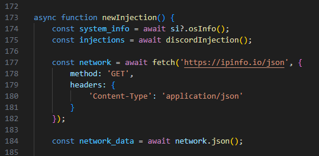

This (ipinfo.io) seems clearly to be the site used to retrieve the public IP of the infected system.

**Answer:** `https://ipinfo.io/json`

---

### Task 7

The malware is looking for a particular path to connect back on. What is the full URL used for C2 of this malware?

This we already got from the earlier task with the whole URL being `https://illitmagnetic.site/api`

**Answer:** `https://illitmagnetic.site/api`

---

### Task 8

The malware has a configured user_id which is sent to the C2 in the headers or body on every request. What is the key or variable name sent which contains the user_id value?

We can figure this out from later on the code when there is some POST HTTP request being declared the key/variable name here is `duvet_user` which reads the user_id from options list which was declared at the beginning.

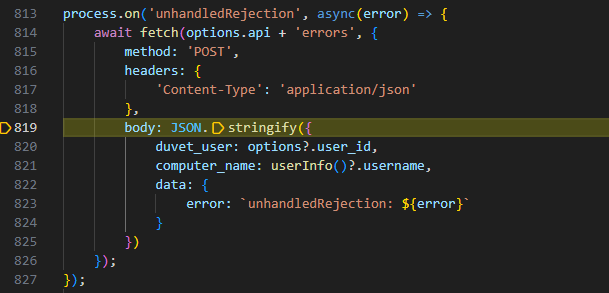

**Answer:** duvet_user

--- 

### Task 9

The malware checks for a number of hostnames upon execution, and if any are found it will terminate. What hostname is it looking for that begins with `arch`?

Searching for arch in the debugged code gives us that the hostname being looked for is archibaldpc and if it is found it will terminate as seen in the screenshot below.

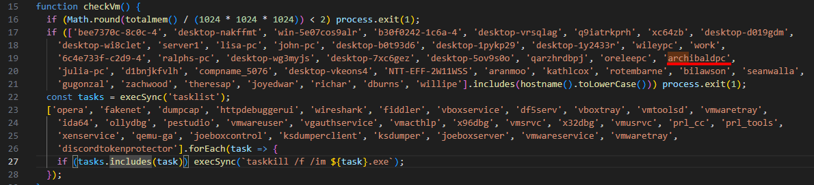

The checkVm function also seems to kill the following processes mentioned in the "tasklist"

**Answer:** archibaldpc

---

### Task 10

The malware looks for a number of processes when checking if it is running in a VM; however, the malware author has mistakenly made it check for the same process twice. What is the name of this process?

We can get this answer by looking at the tasklist I mentioned above. And it seems that the author checks for vmwaretray twice as seen in the screenshot.

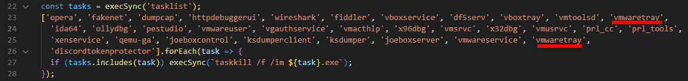

**Answer:** vmwaretray

--- 

### Task 11

The malware has a special function which checks to see if C:\Windows\system32\cmd.exe exists. If it doesn't it will write a file from the C2 server to an unusual location on disk using the environment variable USERPROFILE. What is the location it will be written to?

Searching the code for cmd.exe we can find the corresponding function which includes the if and else statements.

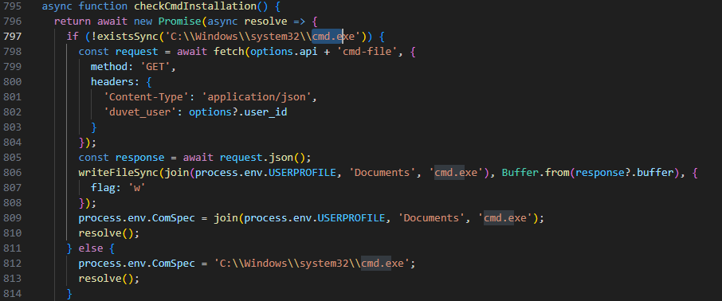

From here we can see that the malware writes the file to %USERPROFILE%\Documents\cmd.exe

**Answer:** %USERPROFILE%\Documents\cmd.exe

---

### Task 12

The malware appears to be targeting browsers as much as Discord. What command is run to locate Firefox cookies on the system?

Upon closer inspection I was able to find the getFirefoxCookies function which exactly has the command which locates the Firefox cookies on system.

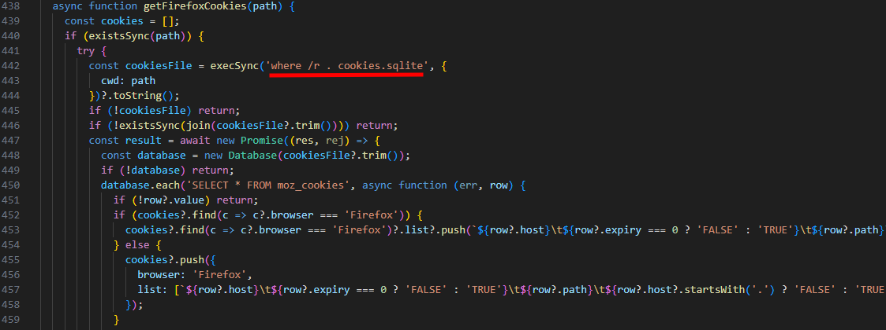

The command seems to be where /r . cookies.sqlite

**Answer:** where /r . cookies.sqlite

--- 

### Task 13

To finally eradicate the malware, Forela needs you to find out what Discord module has been modified by the malware so they can clean it up. What is the Discord module infected by this malware, and what's the name of the infected file?

We are able to find the function that handles the injection which particularly targets discord_desktop_core-1 module and specifically index.js file.

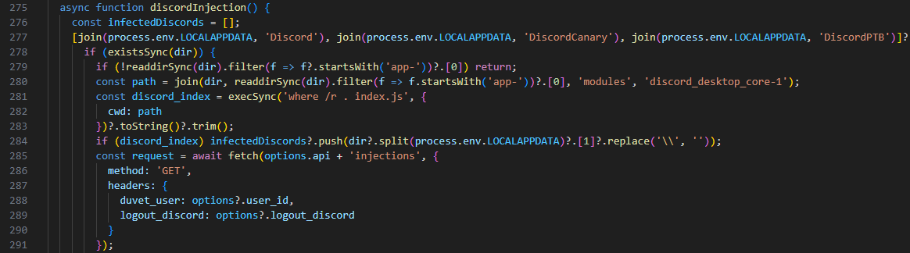

**Answer:** discord_desktop_core-1, index.js

--- 

## Further Analysis

### Indicators of Compromise (IOCs)

- **Potentially malicious file written under Documents:** `%USERPROFILE%\Documents\cmd.exe`
- **Downloaded exe:** `nsis-installer.exe`
- **C2 Domain:** `illitmagnetic.site`

More in depth analysis coming soon!

## Conclusion

Overall it was a fun Sherlock to use the debug tool to figure out the different parts of the malware. To be said though it took a while to acknowledge how to debug it and also the FlareVM setup in my part took some time. After we got the deobfuscated code it was kinda too easy since all you had to do was to search for all the answers in that code. I would have hoped little more depth to it rather than doing only this approach.

But that being said it was still good Sherlock since I learned how to analyze malware and also some new techniques when dealing with malware.


https://labs.hackthebox.com/achievement/sherlock/2339218/636
